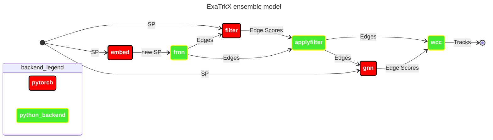

# Triton Service

This folder contains instructions on how to operate the ensemble-backend Triton service. Within this folder are instruction on creating [python_backends](python_backends/README.md#python-backends), the [model repositories](model_repos/README.md) configration and files relating to the prometheus, grafana and nginx services, and bash scripts [scripts](scripts) that launch, monitor, and evaluate the server.


**Figure 1**: ExaTrkX Triton server pipeline



**Table 1**: ExaTrkX Triton server pipeline
**Stage**|**Backend**
:-----|:-----
`embed`| PyTorch
`frnn`| Python
`filter`| PyTorch
`applyfilter`| Python
`gnn`| PyTorch
`wcc`| Python


> *Note*
> All scripts are in the folder [scripts](scripts)

# Setup
Change the `$EXATRKX_HOME` to the directory to yours.

Execute this code during first time setup in order to setup the correct environment + compile ExaTrkx C++ pipeline code:
```bash
source setup.sh
```

Copy the Python Backend tar files into `$SCRATCH/exatrxk/python_backends/`. If you don't have a copy of them you can make them following the instruction in [triton_service/python_backends](triton_service/python_backends/README.md#python-backends).

# Usage 

## Triton Server
Launch the inference server interactively via:
```bash
./deploy_triton.sh
```

Or operate in batch mode via sbatch:
```bash
sbatch --account=<elvis> deploy_triton.sh
```

## Inference Binary
Run the inference binary in parallel with:
```bash
./run_exatrkx.sh server_ip_address:8001 [optional: -d data_folder -n njobs -j cpu_threads_per_job -q/--quiet]
```

## Grafana Dashboard + Nginx Load Balancer
To run the Grafana Dashboard and connect the triton servers to a load balancer run:
```bash
./monitor_triton.sh slurm_jobid
```

To save key metrics run (see [file](triton_service/triton_metrics.py)):
```bash
python triton_service/triton_metrics.py --ip server_ip_address:8002
```

# Notes
