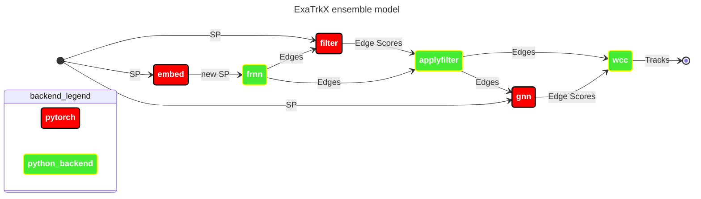

# Model Repositories

This folder contains two model repository folders for the nvidia triton inference server to use. It is recommended to use the models contained with the `models` folder. The `models_trackML` was prepared for use with the track ML dataset.

**Figure 1**: ExaTrkX Triton server pipeline




## Testing models
Use the `test_triton_model.py` to test models on the triton server:
```bash
python test_triton_model.py [triton_model] [inputs] -t/--triton_address [ip_address]
```

Example:
```bash
python3 test_triton_model.py exatrkx ../../data/exatrkx_input_FEATURES.csv -t 128.55.65.210:8001
```
