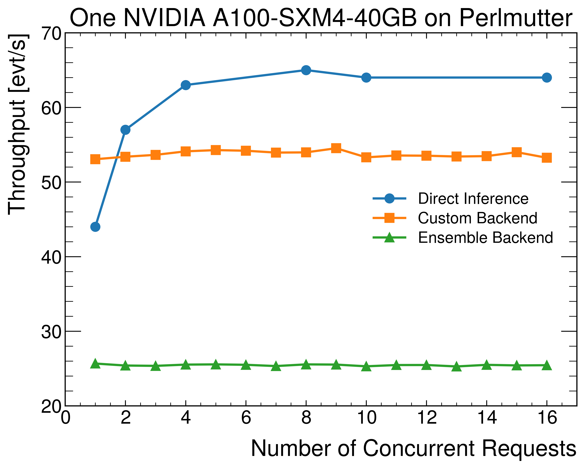
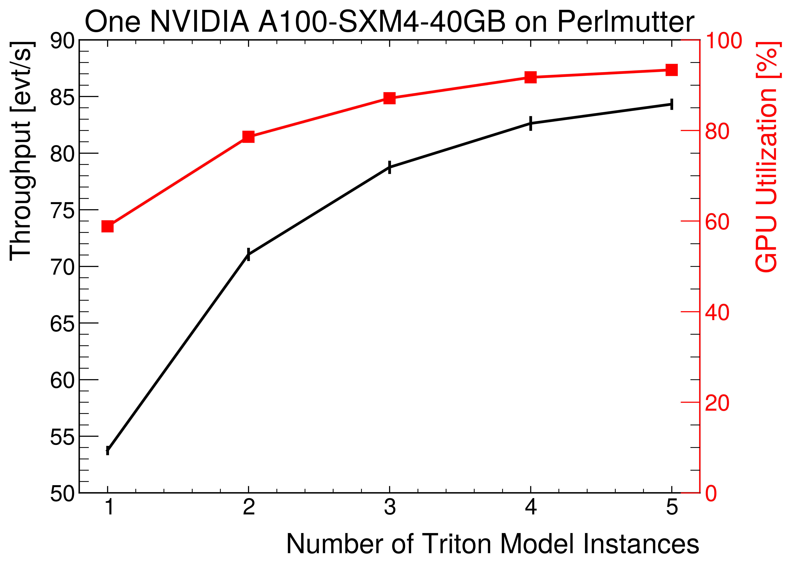

# Evluate the Time performance 

A docker image is provided for the evaluation where the triton backend is compiled and installed, 
as well as the cpp version triton client `inference-aas`: `hrzhao076/exatrkx_triton_backend:4.0`.


## Start the server
```bash 
podman-hpc run -it --rm --gpu --shm-size=20g -p8000:8000 -p8001:8001 -p8002:8002 -v ${PWD}:/workspace hrzhao076/exatrkx_triton_backend:4.0
tritonserver --model-repository=/opt/model_repos
```

## Start the client

```bash 
podman-hpc run -it --rm --gpu --ipc=host --net=host --ulimit memlock=-1 --ulimit stack=67108864 -v ${PWD}:/workspace/ hrzhao076/exatrkx_triton_backend:4.0
```

## Perform the evaluation 

```bash
# measuring the time to process 100 events 
cd /workspace/evaluate/
python evaluate_time.py

# if you want to use more events(5000), use the following command
# python evaluate_time.py --use-more 

# The CTD2023 result is obtained by using the following command 
# use perf_analyzer to measure the time
# first convert the 100 events into a json file 
python convert_csv2json.py --input /workspace/exatrkx_pipeline/datanmodels/lrt/inputs 

perf_analyzer -m exatrkxgpu --percentile=95 -i grpc --input-data /workspace/exatrkx_pipeline/datanmodels/lrt/inputs.json --measurement-interval 10000

# a script is provided to run the perf_analyzer on a compute node 
srun scripts/evaluate_triton.sh 

# one can also submit a slurm job to run the evaluation
# need to check the account and output_dir in the slurm_1gpu.sub file 
sbatch slurm/slurm_1gpu.sub 

# Then run the ipython notebook to plot the results
# evaluate/plotting/plot_1GPU.ipynb
```
## CTD results 



